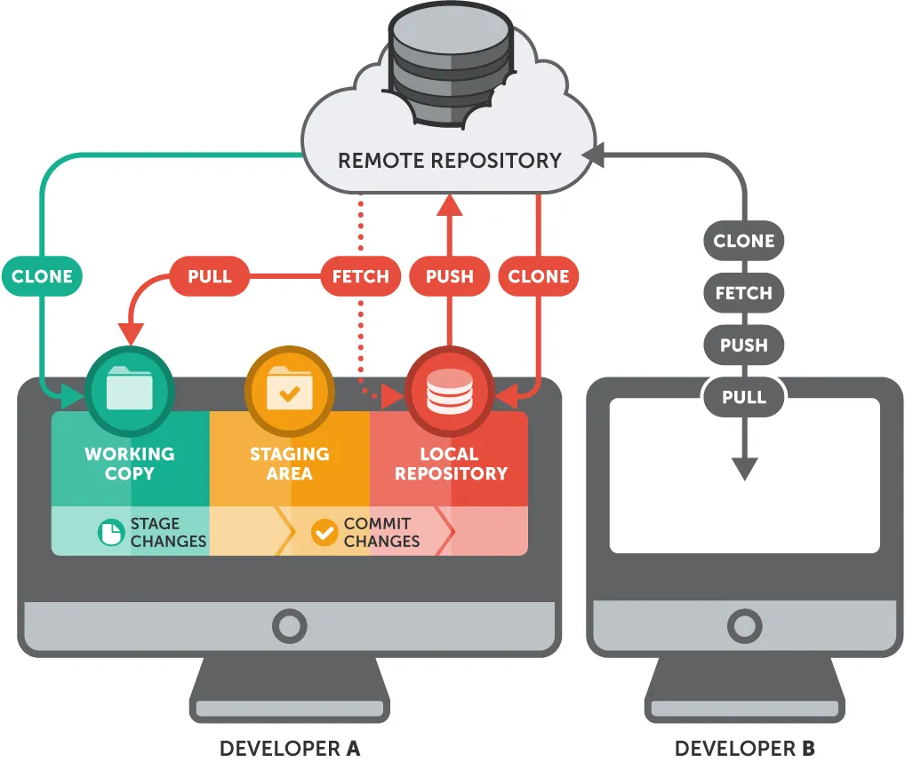

# Git



Git is a distributed version control system used to track and manage changes in software development projects. The basic workflow of Git involves transitioning changes between the **working directory**, **staging area**, and **local repository**. Here’s a detailed explanation of Git’s stages and processes:

## 1. **Working Directory**

- The **working directory** is the folder on your local machine where your project files reside. When you create a Git repository or clone an existing one, all files are placed in the working directory.
- When you make changes to files in this directory, Git tracks them, but these changes aren’t yet ready to be committed.

## 2. **Staging Area**

- The **staging area** (also called the **index**) is where you prepare changes before committing them. When you modify files in the working directory and want to include those changes in the next commit, you need to add them to the staging area.
- Use the `git add` command to move changes from the working directory to the staging area.

  ```bash
  git add <file_name>  # Adds a specific file to the staging area
  git add .            # Adds all changes in the working directory to the staging area
  ```

- The files in the staging area are now ready to be committed to the repository.

## 3. **Commit (Saving Changes to Local Repository)**

- A **commit** is a snapshot of the project at a specific point in time. It records the changes that were staged.
- To commit the changes, use the `git commit` command. You will also need to include a message describing the changes made.

  ```bash
  git commit -m "Commit message describing the changes"
  ```

- This command permanently saves the changes to your **local repository**.

## 4. **Viewing the Commit History**

- To view the history of commits, you can use the `git log` command. This shows a list of all commits, including the hash, author, date, and commit message.

  ```bash
  git log
  ```

## 5. **Pushing to a Remote Repository**

- Git allows you to share your changes with others by pushing them to a **remote repository**, typically hosted on services like GitHub, GitLab, or Bitbucket.
- After committing your changes locally, use the `git push` command to upload them to the remote repository.

  ```bash
  git push origin main  # Pushes changes to the main branch on the remote repository
  ```

## 6. **Pulling Updates from the Remote Repository**

- To bring changes from a remote repository to your local one, you can use two main commands:
  - `git fetch`: Downloads changes from the remote repository but does not apply them to your working directory.
  - `git pull`: Downloads and applies the changes to your working directory, combining the fetch and merge steps.

  ```bash
  git pull origin main
  ```

## 7. **Working with Branches**

- **Branches** are used to work on different features or fixes independently from the main codebase. This allows multiple people to work on different parts of the project simultaneously without interfering with each other.
- To create a new branch:

  ```bash
  git branch <new-branch-name>
  ```

- To switch between branches:

  ```bash
  git checkout <branch-name>
  ```

- To merge changes from one branch into another:

  ```bash
  git merge <branch-name>
  ```

## 8. **Handling Merge Conflicts**

- Sometimes, when merging changes from different branches, you may encounter **merge conflicts** if the same part of a file was edited in both branches.
- Git will notify you of the conflict and allow you to manually resolve it by editing the file and choosing which changes to keep. Once resolved, you can commit the changes.

## 9. **Undoing Changes (Reset, Revert, Checkout)**

- Git provides several ways to undo changes:
  - `git reset`: Moves the HEAD to a previous commit and optionally modifies the staging area and working directory.
  - `git revert`: Reverts a specific commit by creating a new commit that undoes the changes from the specified commit.
  - `git checkout <file>`: Restores a file to its state from the latest commit.

## Git Workflow Summary

1. **Work in the Working Directory**: Modify files.
2. **Stage Changes**: Add files to the staging area using `git add`.
3. **Commit Changes**: Save the staged changes to the local repository using `git commit`.
4. **Push Changes**: Send commits to a remote repository with `git push`.
5. **Pull Changes**: Retrieve and apply changes from the remote repository using `git pull`.
