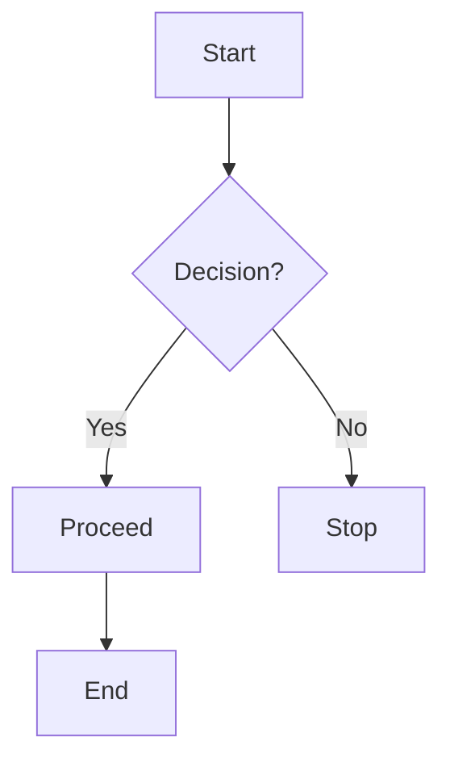

# Chart Language

**Mermaid** is a lightweight JavaScript-based diagramming and charting tool that allows you to define diagrams in text format. It simplifies the process of creating complex flowcharts, sequence diagrams, Gantt charts, class diagrams, and other types of visual representations, without needing to use a graphical interface. The diagrams are written in a simple markup language and are rendered as SVGs (Scalable Vector Graphics).

## Key Features:

- **Text-based**: Diagrams are created using text, making it easy to version control and collaborate in codebases.
- **Automated Rendering**: Mermaid automatically generates visual diagrams from simple text input, which can be easily integrated into Markdown files, web pages, and more.
- **Variety of Diagrams**: Supports multiple diagram types, including flowcharts, sequence diagrams, Gantt charts, class diagrams, state diagrams, and pie charts.

## Example of a Mermaid Flowchart:

```
graph TD
  A[Start] --> B{Decision?}
  B -->|Yes| C[Proceed]
  B -->|No| D[Stop]
  C --> E[End]
```



This simple example generates a flowchart with a decision point. You can write similar diagrams directly in text form, and Mermaid will handle rendering the graphical representation.

## Supported Diagrams:

- **Flowcharts**: Visualizes processes, steps, or systems.
- **Sequence Diagrams**: Shows interactions between entities over time.
- **Gantt Charts**: Visualizes project timelines and task scheduling.
- **Class Diagrams**: Used in object-oriented programming to represent relationships between classes.
- **State Diagrams**: Describes different states of a system and transitions between those states.
- **Pie Charts**: Displays data in a pie chart format.

Mermaid is widely used in platforms like GitHub, GitLab, and various documentation tools to create diagrams directly in Markdown or web content. Its simplicity and flexibility make it a great tool for software developers, technical writers, and other professionals needing to visualize concepts without the overhead of traditional diagramming software.
