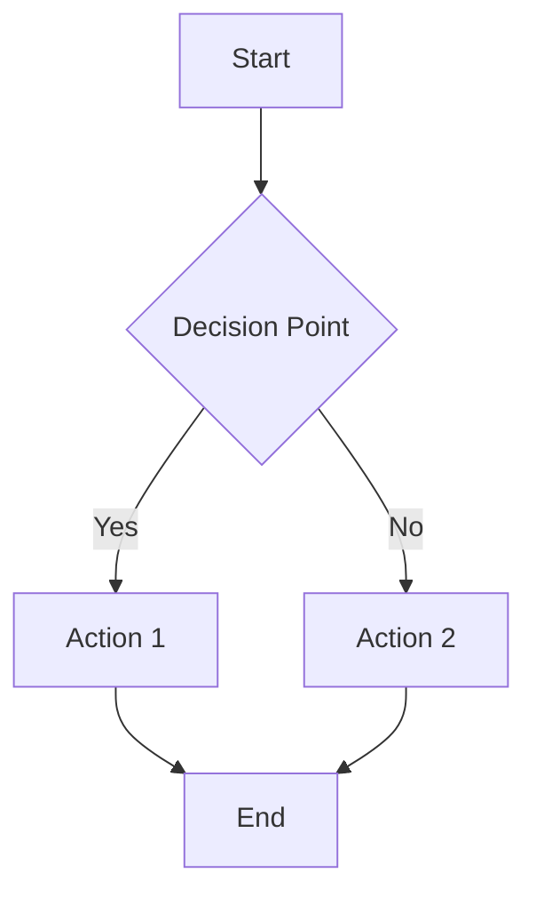
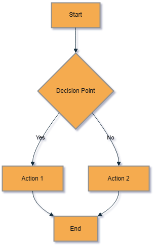

# Flowchart Element List

## 1. **Standard Rectangle (Process)**

- Represents a typical process or step.
- Syntax: `ID[Text]`
   
   ```mermaid
   A[Process]
   ```

## 2. **Rounded Rectangle (Subprocess)**

- Represents a subprocess or alternative process.
- Syntax: `ID(Text)`
   
   ```mermaid
   B(Rounded Process)
   ```

## 3. **Circle (Start/End)**

- Typically used for the start or end of a process.
- Syntax: `ID((Text))`
   
   ```mermaid
   C((Start/End))
   ```

## 4. **Diamond (Decision)**

- Represents a decision point with multiple possible outcomes.
- Syntax: `ID{Text}`
   
   ```mermaid
   D{Decision}
   ```

## 5. **Parallelogram (Input/Output)**

- Used for data input or output.
- Syntax: `ID[/Text/]` or `ID[\Text\]`
   
   ```mermaid
   E[/Input/]
   ```

## 6. **Hexagon (Preparation)**

- Represents preparation steps or setup activities.
- Syntax: `ID{{Text}}`
   
   ```mermaid
   F{{Preparation}}
   ```

## 7. **Parallelogram (Input/Output)**

- Used for data input or output.
- Syntax: `ID[/Text/]` or `ID[\Text\]`
   
   ```mermaid
   E[/Input/]
   ```

## 8. **Links (Arrows)**

- Connects flowchart components and shows the flow direction.
- **Solid Arrow**: `-->`
- **Dashed Arrow**: `-.->`
- **Thick Arrow**: `==>`
   
   ```mermaid
   A --> B
   B -.-> C
   A ==> D
   ```

## 9. **Text Labels on Links**

- Adds labels to arrows to describe conditions or actions.
- Syntax: `ID -->|Text| ID`
   
   ```mermaid
   A -->|Yes| B
   A -->|No| C
   ```

## 10. **Subgraphs**

- Groups a set of nodes into a named cluster.
- Syntax: `subgraph Name ... end`
   
   ```mermaid
   subgraph Cluster1
     A --> B
   end
   ```

## 11. **Direction**

- Sets the direction of the flow in the chart.
- **TD** (Top to Down): `graph TD`
- **LR** (Left to Right): `graph LR`
- **BT** (Bottom to Top): `graph BT`
- **RL** (Right to Left): `graph RL`
   
   ```mermaid
   graph LR
   ```

## 12. **Loops**

- Represents a process that repeats or loops.
- Syntax: You can link a node back to itself.
   
   ```mermaid
   A --> B
   B --> A
   ```

## 13. **Notes**

- Adds explanatory notes to the flowchart.
- Syntax: `ID ---|Note| ID`
   
   ```mermaid
   A ---|Note| B
   ```

## 14. **Styling Components**

- Customize the appearance of flowchart elements.
- Syntax: `classDef className ...`
- Use `class ID className` to apply the style.
   
   ```mermaid
   classDef green fill:#9f6,stroke:#333,stroke-width:2px;
   A --> B
   class A green
   ```

## Sample



## Explanation:

- **A**: Represents the start of the process.
- **B**: A decision point where the flow can branch based on "Yes" or "No".
- **C**: The action to take if the decision is "Yes".
- **D**: The action to take if the decision is "No".
- **E**: Represents the end of the process.

The diagram has a top-down (TD) flow, and arrows show the direction between each step.


