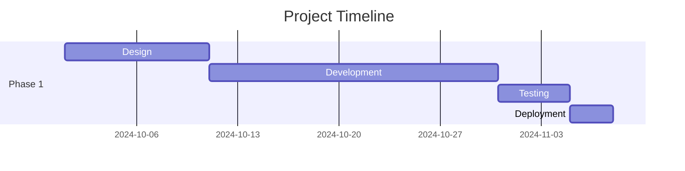
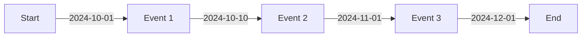

# Timeline

In Mermaid, there isn't a specific built-in component called "timeline," but you can represent timelines using various diagram types like **Gantt charts** or creatively modifying **flowcharts** to show events or processes in sequence over time. Mermaid does not have a dedicated "timeline" diagram type, but these are the main components you can use to build timelines using other supported diagrams:

## 1. **Gantt Chart**

Gantt charts are often used to represent timelines in project management. Here’s the list of Gantt chart components in Mermaid:

### Components for Gantt Charts:

- **Title**: Defines the title of the Gantt chart.
  ```mermaid
  gantt
    title Project Timeline
  ```
  
- **DateFormat**: Specifies the format of dates used in the chart (e.g., `YYYY-MM-DD`).
  ```mermaid
  dateFormat  YYYY-MM-DD
  ```

- **Section**: Groups tasks under a specific category or phase.
  ```mermaid
  section Phase 1
  ```

- **Tasks**: Define tasks or events with a start date and duration.
  - `Task name`: Describes the task.
  - `Start date`: The task's start date.
  - `Duration`: The number of days the task lasts.
  ```mermaid
  task1 :a1, 2024-10-01, 10d
  ```

- **Dependencies**: Represents dependencies between tasks using arrows.
  ```mermaid
  task2 :a2, after a1, 7d
  ```

### Example Gantt Chart (Timeline Representation):



## 2. **Flowchart** for Timelines

Although Mermaid doesn't have a specific timeline component, you can create a simple flowchart to represent events or milestones on a timeline.

### Components for Flowcharts (adapted for a timeline)

- **Rectangles (Standard Steps)**: Use rectangles to represent events or milestones.
  ```mermaid
  A[Event 1]
  ```

- **Arrows (Time Progression)**: Use arrows to represent the flow of time.
  ```mermaid
  A --> B
  ```

- **Dates/Time Labels**: You can add time labels or other notes to arrows or nodes to indicate dates or periods.
  ```mermaid
  A -->|2024-10-01| B
  ```

### Example Flowchart (Timeline Representation)



## 3. **Sequence Diagrams for Timelines**

While not traditionally used for timelines, **sequence diagrams** could be adapted to represent a series of events over time by displaying interactions between objects or participants.

### Components for Sequence Diagrams

- **Participants**: Define entities involved in the timeline.
  ```mermaid
  participant Alice
  participant Bob
  ```

- **Messages/Interactions**: Represent the interaction or event happening at a certain time.
  ```mermaid
  Alice -> Bob: Event 1
  ```

### Example Sequence Diagram (Timeline Representation)

```mermaid
sequenceDiagram
    participant Time
    Time ->> Event1: 2024-10-01
    Time ->> Event2: 2024-10-10
    Time ->> Event3: 2024-11-01
    Time ->> End: 2024-12-01
```

## Conclusion:
While there isn't a dedicated "timeline" component in Mermaid, you can creatively use **Gantt charts**, **flowcharts**, or even **sequence diagrams** to represent timelines. Each of these components allows you to visually depict events over time in a structured way, depending on the complexity and type of timeline you wish to build.
