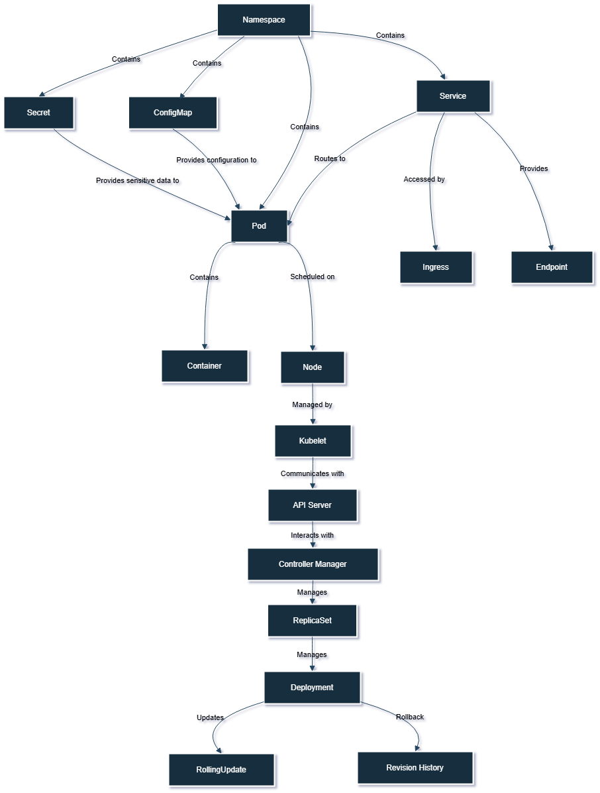

| **Command**                                  | **Description**                                                   |
|----------------------------------------------|-------------------------------------------------------------------|
| `kubectl get pods`                           | List all pods in the current namespace.                          |
| `kubectl get services`                       | List all services in the current namespace.                     |
| `kubectl get deployments`                    | List all deployments in the current namespace.                  |
| `kubectl describe pod <pod_name>`           | Display detailed information about a specific pod.               |
| `kubectl create -f <file.yaml>`             | Create a resource defined in a YAML or JSON file.               |
| `kubectl apply -f <file.yaml>`              | Apply changes to a resource defined in a YAML or JSON file.     |
| `kubectl delete pod <pod_name>`             | Delete a specific pod.                                          |
| `kubectl logs <pod_name>`                   | Fetch logs from a specific pod.                                 |
| `kubectl exec -it <pod_name> -- /bin/bash`  | Execute a command in a running pod (interactive shell).         |
| `kubectl scale deployment <deployment_name> --replicas=<number>` | Scale a deployment to a specified number of replicas.           |
| `kubectl port-forward <pod_name> <local_port>:<pod_port>` | Forward one or more local ports to a pod.                     |
| `kubectl get nodes`                          | List all nodes in the cluster.                                  |
| `kubectl get namespaces`                     | List all namespaces in the cluster.                             |
| `kubectl config view`                        | View the current configuration and context.                     |
| `kubectl top nodes`                          | Show metrics for nodes in the cluster (CPU/memory usage).      |

### Usage

To use these commands effectively, ensure you have `kubectl` installed and configured to communicate with your Kubernetes cluster. Always check the current context and namespace to avoid any confusion while managing your resources.

